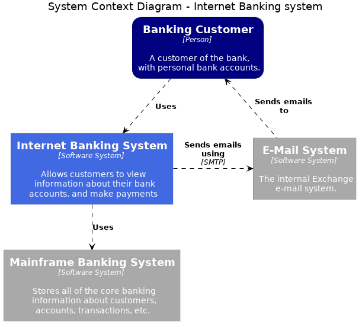
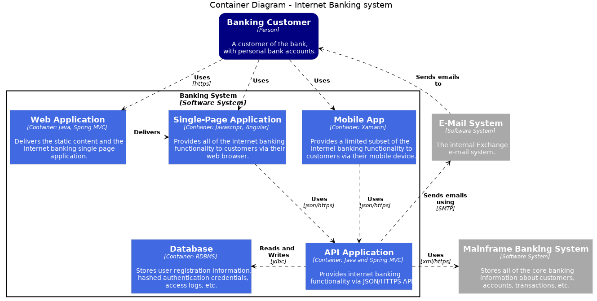
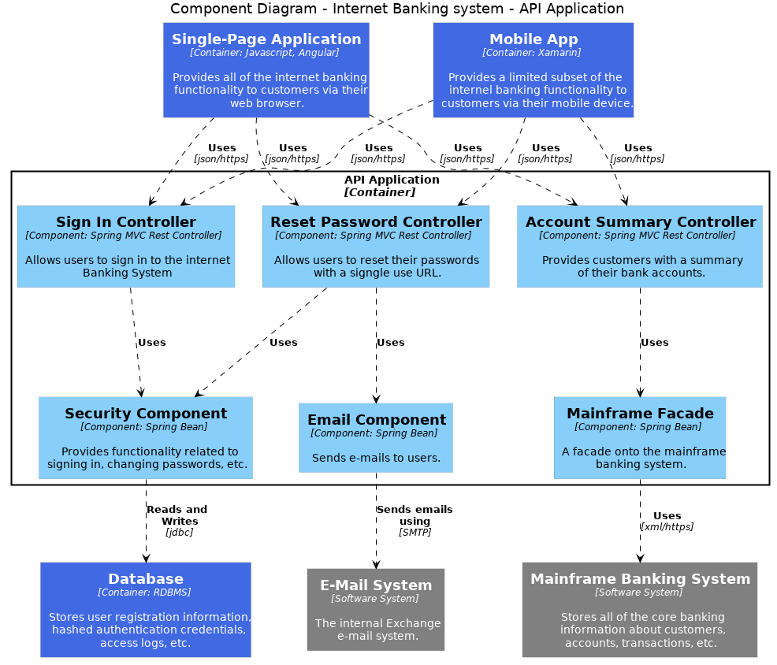

# PlantUML macros for C4 Architecture diagrams 

This is a set of macros to produce C4 architecture diagrams using plantuml text based diagram tool.



## What are C4 diagrams and why use them.
I've been using C4 Architecture diagrams formalized by Simon Brown to document the architecture for the projects I work on. 

You can read more about C4 diagrams on Simon Brown's [site](https://c4model.com/).

C4 diagrams help document and communicate the architecture plans in the context of agile software development. They are lean, clear, and quick to produce.

## How can this project be useful

This project combine the power of C4 architecture diagrams with the great text based diagram tool [Plantuml](http://plantuml.com).

Main pros of using these macros:

- leverage the C4 modeling top down lean approach to design documentation
- descriptive language instead of WYSIWIG diagram editors.
- is text so you can store in source control
- can be rendered in so many editors, IDEs, wikis, sites, build tools, or command line. See [this](http://plantuml.com/running) page for a complete list.
- changing the look of the diagrams is handled like configuration.
- refactoring diagrams is easy since this is all text. You can use editors, sed, awk, or anything you would like.


My aim is to implement macros for the 3 main C4 diagrams:

1. System context diagram (Ready)
2. Container diagram (Ready)
3. Component diagram (Ongoing)


## Getting Started


### Import the macros in your project file

Include the c4-macros.puml plantuml file to import the necessary macros.

```puml	
!include plantuml-c4-macros/c4-macros.puml
```
or via url 
```puml	
!define C4URL https://TBD/
!includeurl C4URL/c4-macros.puml
```

### use the macros you need to create C4 elements or relations

```puml

C4_SYSTEM_CONTEXT_TITLE("Enter the title for your system context diagram") ' sets the title of the system context diagram'
C4_CONTAINER_TITLE("Enter the title for your container diagram") ' sets the title of the container diagram'
C4_PERSON(id, name, description) ' create a person element. stereotype: person
C4_SYSTEM(id, name, description) ' create your system element. stereotype: system
C4_SYSTEM_OUTLINE(id, name) ' create a system outline. to be used in the container diagram. stereotype: outline
C4_OTHER_SYSTEM(id, name, description) ' create systems your system depends on. stereotype: other_system
C4_CONTAINER(id, name, techno, description) ' create a container element. stereotype: container
C4_REL(description) ' create a relationship between systems
C4_REL(description, techno) ' create a relationship between systems. Adds technologies to the relation.

```

After this is done, you can create relationship between element ids like any other plantuml diagrams.

Also note that you can change the look by specifying skinparams value on the stereotype used by the macros.

### Change font and background colors

You now can set your own font and background colors. Just define the necessary macros before loading the c4 macros.

Here is a list of constants you can define:
```puml

!define C4_PERSON_FONTCOLOR White
!define C4_SYSTEM_FONTCOLOR White
!define C4_OUTLINE_FONTCOLOR Black
!define C4_OTHER_SYSTEM_FONTCOLOR White
!define C4_CONTAINER_FONTCOLOR White
!define C4_COMPONENT_FONTCOLOR Black
!define C4_PERSON_BGCOLOR Navy
!define C4_SYSTEM_BGCOLOR RoyalBlue
!define C4_OUTLINE_BGCOLOR White
!define C4_OTHER_SYSTEM_BGCOLOR Grey
!define C4_CONTAINER_BGCOLOR RoyalBlue
!define C4_COMPONENT_BGCOLOR LightSkyBlue
```

## Examples

Examples can also be found in the git examples folder.

### System context diagram
	
```puml

!include ../c4-macros.puml

C4_SYSTEM_CONTEXT_TITLE("Internet Banking system")

C4_PERSON(customer, "Banking Customer", "A customer of the bank,\nwith personal bank accounts.")
C4_SYSTEM(bankingSystem, "Internet Banking System", "Allows customers to view\ninformation about their bank\naccounts, and make payments")
C4_OTHER_SYSTEM(emailSystem, "E-Mail System", "The internal Exchange\ne-mail system.")
C4_OTHER_SYSTEM(mainframe, "Mainframe Banking System", "Stores all of the core banking\ninformation about customers,\naccounts, transactions, etc.")

customer .d.> bankingSystem: C4_REL("Uses")
bankingSystem .r.> emailSystem: C4_REL("Sends emails using", "SMTP")
emailSystem .u.> customer: C4_REL("Sends emails to")
bankingSystem .d.> mainframe: C4_REL("Uses")

```


### Container diagram
	
```puml

!include ../c4-macros.puml

C4_CONTAINER_TITLE("Internet Banking system")

C4_PERSON(customer, "Banking Customer", "A customer of the bank,\nwith personal bank accounts.")
C4_SYSTEM_OUTLINE(bankingSystem, "Banking System") {
  C4_CONTAINER(web, "Web Application", "Java, Spring MVC", "Delivers the static content and the\ninternet banking single page\napplication.")
  C4_CONTAINER(spa, "Single-Page Application", "Javascript, Angular", "Provides all of the internet banking\nfunctionality to customers via their\nweb browser.")
  C4_CONTAINER(mobile, "Mobile App", "Xamarin", "Provides a limited subset of the\ninternel banking functionality to\ncustomers via their mobile device.")
  C4_CONTAINER(api, "API Application", "Java and Spring MVC", "Provides internet banking\nfunctionality via JSON/HTTPS API")
  C4_CONTAINER(db, "Database", "RDBMS", "Stores user registration information,\nhashed authentication credentials,\naccess logs, etc.")
}

C4_OTHER_SYSTEM(emailSystem, "E-Mail System", "The internal Exchange\ne-mail system.")
C4_OTHER_SYSTEM(mainframe, "Mainframe Banking System", "Stores all of the core banking\ninformation about customers,\naccounts, transactions, etc.")

customer .d.> web: C4_REL("Uses", "https")
customer .d.> spa: C4_REL("Uses")
customer .d.> mobile: C4_REL("Uses")
web .r.> spa: C4_REL("Delivers")
spa ..> api: C4_REL("Uses", "json/https")
mobile ..> api: C4_REL("Uses", "json/https")
api .l.> db: C4_REL("Reads and Writes", "jdbc")
api .r.> mainframe: C4_REL("Uses", "xml/https")
api .u.> emailSystem: C4_REL("Sends emails using", "SMTP")
emailSystem .u.> customer: C4_REL("Sends emails to")

```


### Component diagram
	
```puml

!include ../c4-macros.puml


C4_COMPONENT_TITLE("Internet Banking system - API Application")

C4_CONTAINER(spa, "Single-Page Application", "Javascript, Angular", "Provides all of the internet banking\nfunctionality to customers via their\nweb browser.")
C4_CONTAINER(mobile, "Mobile App", "Xamarin", "Provides a limited subset of the\ninternel banking functionality to\ncustomers via their mobile device.")

C4_CONTAINER_OUTLINE(api, "API Application") {
  C4_COMPONENT(signin, "Sign In Controller", "Spring MVC Rest Controller", "Allows users to sign in to the internet\nBanking System")
  C4_COMPONENT(security, "Security Component", "Spring Bean", "Provides functionality related to\nsigning in, changing passwords, etc.")

  C4_COMPONENT(reset, "Reset Password Controller", "Spring MVC Rest Controller", "Allows users to reset their passwords\nwith a signgle use URL.")
  C4_COMPONENT(email, "Email Component", "Spring Bean", "Sends e-mails to users.")

  C4_COMPONENT(summary, "Account Summary Controller", "Spring MVC Rest Controller", "Provides customers with a summary\nof their bank accounts.")
  C4_COMPONENT(mainframeFacade, "Mainframe Facade", "Spring Bean", "A facade onto the mainframe\nbanking system.")

}

C4_CONTAINER(db, "Database", "RDBMS", "Stores user registration information,\nhashed authentication credentials,\naccess logs, etc.")
C4_OTHER_SYSTEM(emailSystem, "E-Mail System", "The internal Exchange\ne-mail system.")
C4_OTHER_SYSTEM(mainframe, "Mainframe Banking System", "Stores all of the core banking\ninformation about customers,\naccounts, transactions, etc.")


spa ..> signin: C4_REL("Uses", "json/https")
spa ..> reset: C4_REL("Uses", "json/https")
spa ..> summary: C4_REL("Uses", "json/https")
mobile ..> signin: C4_REL("Uses", "json/https")
mobile ..> reset: C4_REL("Uses", "json/https")
mobile ..> summary: C4_REL("Uses", "json/https")

signin ..> security: C4_REL("Uses")
security ..> db: C4_REL("Reads and Writes", "jdbc")

reset ..> email: C4_REL("Uses")
reset ..> security: C4_REL("Uses")

summary ..> mainframeFacade: C4_REL("Uses")

email ..> emailSystem: C4_REL("Sends emails using", "SMTP")
mainframeFacade ..> mainframe: C4_REL("Uses", "xml/https")

```


## Note and credits

The two main sources of inspirations are C4 models from Simon Brown and Plantuml.

### C4 Models from Simon Brown

This project would not exists without C4 Models as defined by Simon Brown. I highly encourage everyone to buy/read his books!!

All examples are replicas of Simon Brown's examples in its APL licenced [Structurizer client](https://github.com/structurizr/java) and [documentation](https://github.com/structurizr/java/tree/master/docs)

### Plantuml

Plantuml is one of the simplest diagram tools I found. It allows me to quickly create diagrams the same way I code. You can easily share, transform, and version control since they are just plaintext.

## See also

Useful links:

- C4 model diagrams from Simon Brown": [C4 models](https://c4model.com)
- Plantuml: https://plantuml.com
- Plantuml AWS diagram macros from: [AWS_PlantUML](https://github.com/milo-minderbinder/AWS-PlantUML)
- Plantuml ICONS macros : https://github.com/tupadr3/plantuml-icon-font-sprites
